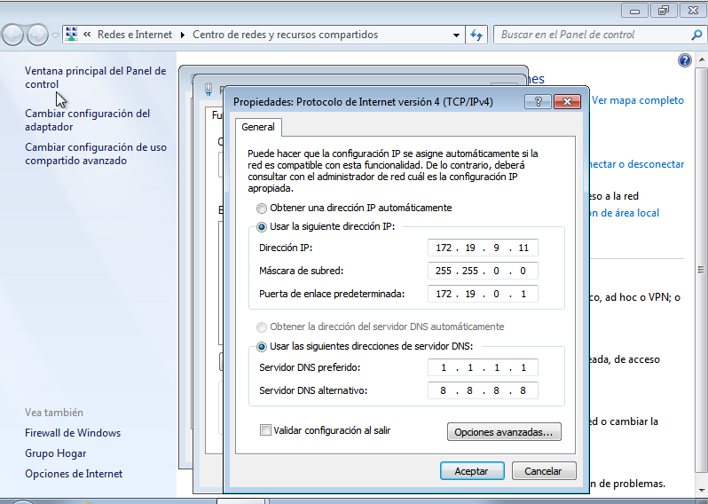
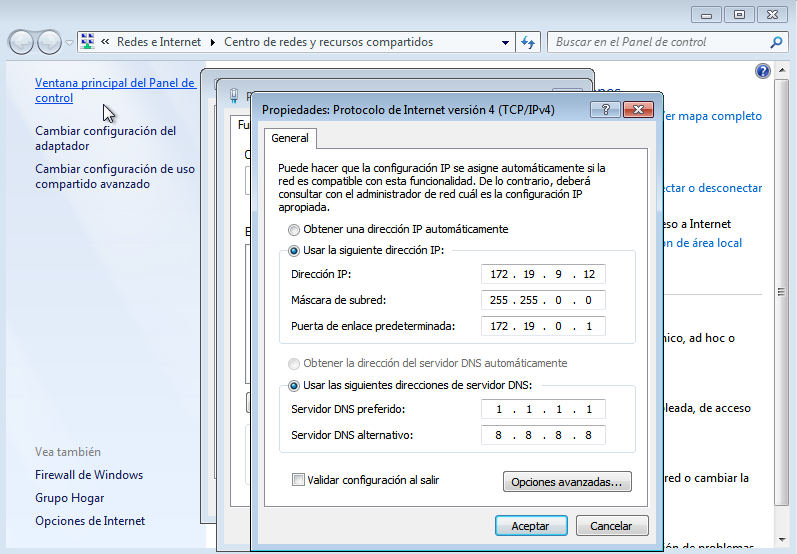
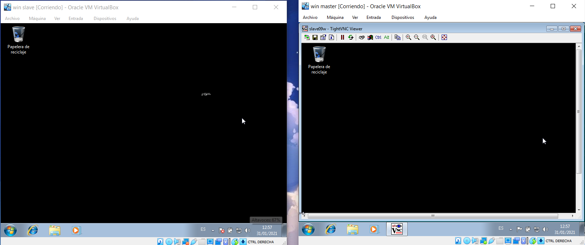
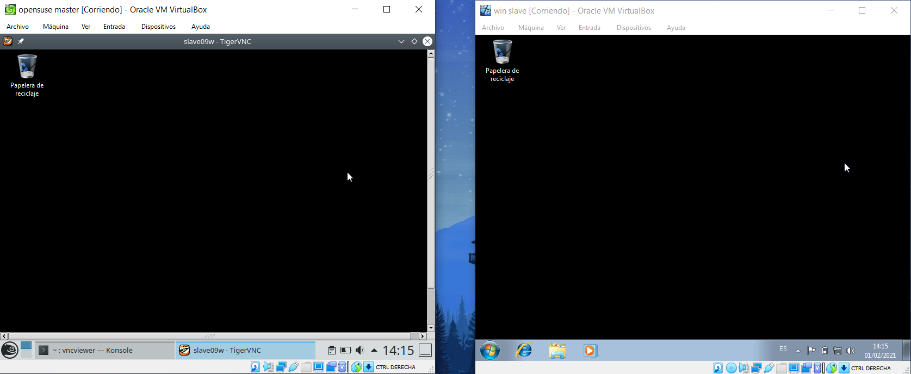
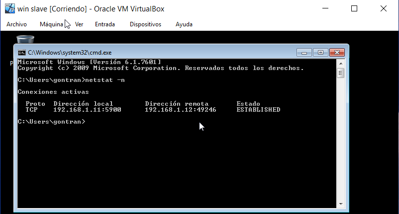

#Acceso Remoto VNC.

                                  Gontran Pestana Fernández - 2ºASIR - P1.

# 1.Windows Slave VNC

- Configurar la máquina virtual siguiendo los pasos del documento entregado y configurar su direccionamiento IP.

## Configuración IP para Windows 7 slave.

- Descargar programa ThightVNC e instalarlo con la siguiente configuración.

## Configuración de la instalacioón de TightVNC.

- Permitir en la configuración del cortafuegos el servidor TightVNC.

## Revisar la configuración del cortafuegos.

# 2.Windows Master VNC.

- Configurar la máquina virtual siguiendo los pasos del documento entregado y configurar su direccionamiento IP en estático.

## Configuración IP para Windows 7 Master.

- Descargar el programa ThightVNC (https://www.tightvnc.com/download.php) e instalarlo igual que en la imagen.

## Configuración de la instalacioón de TightVNC.

- Permitir el servidor TightVNC para el Windows Master.

## Revisar la configuración del cortafuegos.

# 3.Comprobación final

- Funcionamiento del servicio TightVNC en Windows Slave desde Windows Master.

* Conexión

- Funcionamiento del servicio TightVNC en Windows Master desde OpenSuse/Linux master.

* Conexión:

- Funcionamiento del comando netstat -n desde el servidor.

