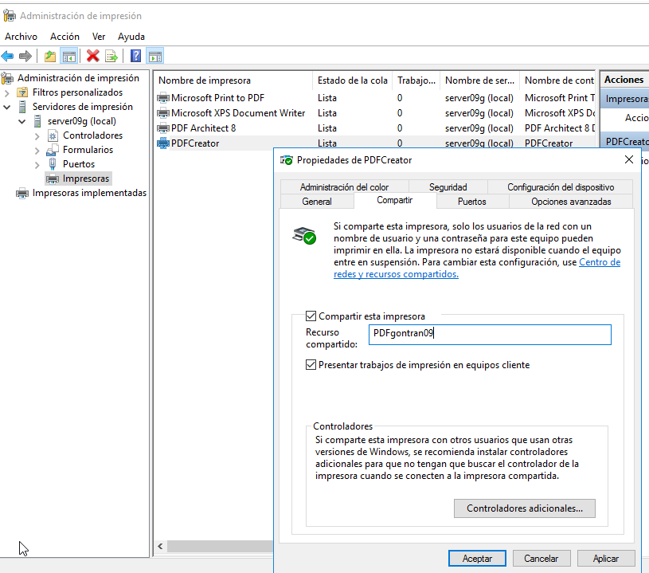

#Servidor de Impresión en Windows

Gontran Pestana   Fernández     2ºASIR - P4

# Preparativos MV's.

1. MV1: Windows Server.
- Ip estática .
- Ram --> 3GB.

2. MV2: Windows 10 cliente
- Ip estática.
- Ram --> 2GB.

# 1. Impresora compartida.

## 1.1 Instalar Rol de impresión.

## 1.2 Instalar impresora PDF.
Vamos a conectar e instalar localmente una impresora al servidor Windows Server, de modo que estén disponibles para ser accedidas

- Descargar PDFCreator (URL recomendada www.pdfforge.org/pdfcreator/download) e instalar.

- En PDFCreator, configurar en perfiles -> Guardar -> Automático. Ahí establecemos la carpeta destino.

## 1.3 Probar la impresora en local.

- Probar la impresora remota imprimiendo documento imprimirXXs-local.

# 2. Compartir por red.

## 2.1 En el servidor

- Ir al Administrador de Impresión -> Impresoras

- Elegir impresora PDFCreator.

        Botón derecho -> Propiedades -> Compartir
        Como nombre del recurso compartido utilizar PDFnombrealumnoXX.

## 2.2 Comprobar desde el cliente.

- Buscar recursos de red del servidor ponemos \\ip-del-servidor.

- Seleccionar impresora -> botón derecho -> conectar.

- Probar la impresora remota imprimiendo documento imprimir09w-remoto.

- Archivo impreso desde el cliente guardado en el servidor.

# 3. Acceso Web.

Configuración para habilitar el acceso web

## 3.1característica impresión WEB.

- Añadiremos las caracteristicas de impresion WEB.

## 3.2 Configurar impresión WEB.

- Abrimos un navegador Web.

- Ponemos URL http://<ip-del-servidor>/printers para que aparezca en nuestro navegador un entorno que permite gestionar las impresoras.

- Url de la impresora PDFCreator --> http://192.168.31.51/printers/PDFgontran09/.printer

## 3.3Comprobar desde el navegador.

- Accede a la configuración de la impresora a través del navegador y pausarla esto hara que los documentos no se impriman al mandar la orden.

- Procederemos a reaunudar la impresiones y sus impresiones activas esto hara que descarge el archivo anterior.

- Se imprimira el archivo pausado y se creara en el escritorio.
