# Servicio de Directorio con comandos.

Gontran Pestana   Fernández     2ºASIR - P4

# 1. Nombre de equipo FQDN.

- Vamos a usar una MV OpenSUSE para montar nuestro servidor LDAP.

- Revisar /etc/hostname. Debe tener un FQDN=serverXXg.curso2021.

- Revisar /etc/hosts

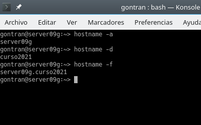

# 2. Instalar el Servidor LDAP.

  # Instalación del paquete.

- zypper in 389-ds, instalar el script de instalación.

- rpm -qa | grep 389-ds, comprobar la versión.

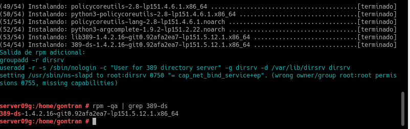

# Configurar la instancia.

- Crear el fichero /root/instance.inf con el siguiente contenido.

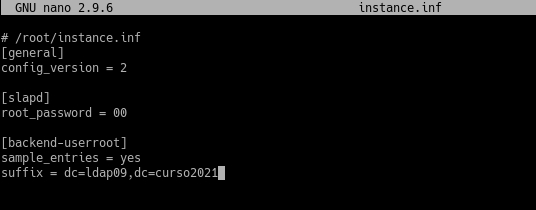

- dscreate from-file /root/instance.inf, creamos una nueva instancia.

- dsctl localhost status, comprobar el estado actual de la instancia de la base de datos LDAP.

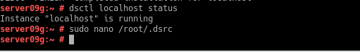

- Creamos el fichero /root/.dsrc con el siguiente contenido.

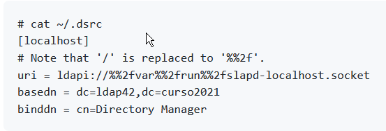

# Comprobamos el servicio

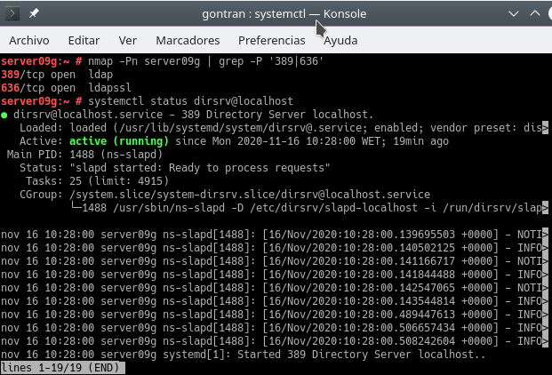

# Comprobar el aceso al contenido del LDAP.

- ldapsearch -b "dc=ldap09,dc=curso2021" -x | grep dn, muestra el contenido de nuestra base de datos LDAP.

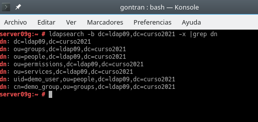

- ldapsearch -H ldap://localhost -b "dc=ldapXX,dc=curso2021" -W -D "cn=Directory Manager" | grep dn, usando usuario/clave.

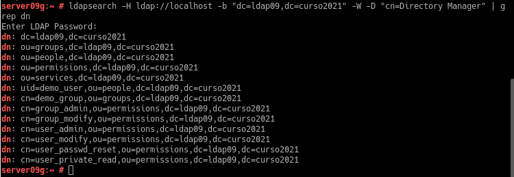

# 3. Añadir usuarios LDAP por comandos.

# Buscar Unidades Organizativas

Deberían estar creadas las OU People y Groups.

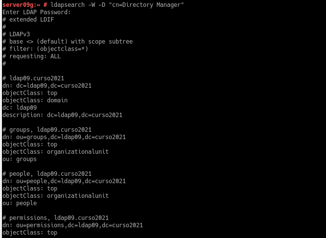

# Agregar usuarios

Vamos a utilizar ficheros ldif para agregar usuarios.

- Crear el Fichero mazinger-add.ldif con la información para crear el usuario mazinger.

- ldapadd -x -W -D "cn=Directory Manager" -f mazinger-add.ldif , escribir los datos del fichero anterior en LDAP.

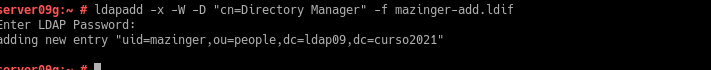

# Comprobar el nuevo usuario

Para listar los usuarios de un directorio, podemos filtrar por "(uid=*)", ya que estamos usando la clase posixAccount.

- ldapsearch -W -D "cn=Directory Manager" -b "dc=ldapXX,dc=curso2021" "(uid=*)", para comprobar si se ha creado el usuario correctamente en el LDAP.

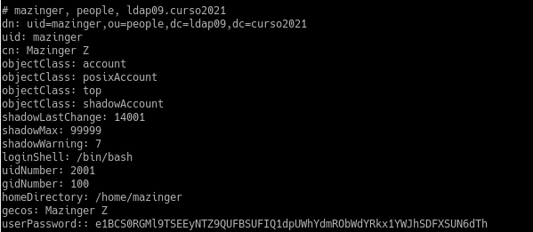

# 4. Contraseñas encriptadas

En el ejemplo anterior la clave se puso en texto plano. Cualquiera puede leerlo y no es seguro. Vamos generar valores de password encriptados.

# Generar clave encriptada SHA.

- Ejecutar zypper in openldap2, para instalar la heramienta slappasswd en OpenSUSE.

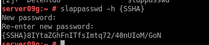

# Agregar más usuarios con clave encriptada

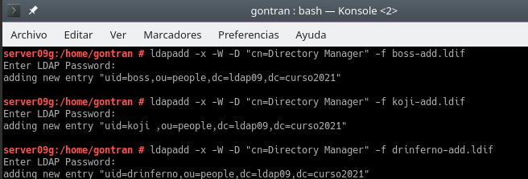

# Comprobar los usuarios creados

- En el cliente.

- nmap -Pn IP-LDAP-SERVER, comprobar que el puerto LDAP del servidor está abierto.

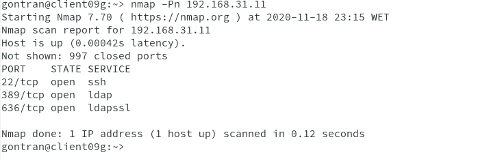

- ldpasearch -H ldap:///IP-LDAP-SERVER -W -D "cn=Directory Manager" -b "dc=ldapXX,dc=curso2021" "(uid=*)" | grep dn para consultar los usuarios LDAP que tenemos en el servicio de directorio remoto.

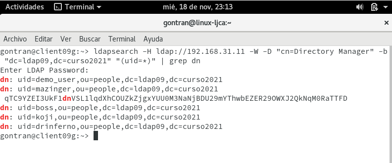
