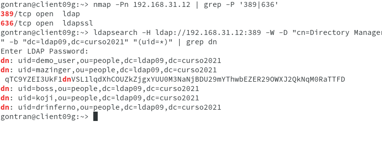

# Cliente con autentificación LDAP.

                                    Gontran Pestana Fernandez

#1.Preparativos

-Necesitamos unna MV con un servidor DS-389 instalado con varios usuarios.

-Y una segunda MV con OpenSuse.

Comprobamos el acceso LDAP desde el ciente:

#2.Configuracion de la autentificación LDAP.

##Conexión con el servidor.

-Ir a Yast -> LDAP y Kerberos.

-Y lo configuramos como la imagen siguiente para tener acceso al servidor.

##Comprobamos la estancia por comandos.

-En la consola del cliente con el usuario root:

#3.Crear usuarios y grupos dentro de LDAP desde el cliente.

-Iremos a Yast -> Gestión de usuarios y grupos.

-Seleccionaremos el filtro de LDAP users.

-Indentificarse en Bind DN

##En este apartado el servidor LDAP deja de autentificar al cliente.

