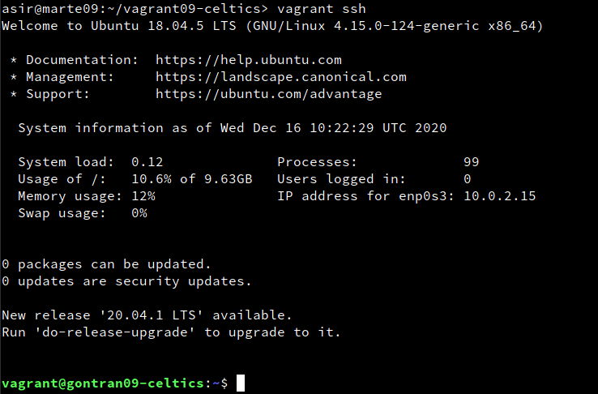

# Vagrant

                                                   Gontran Pestana Fernandez

# 2.Instalar Vagrant.

* Instalamos vagrant en una máquina real.

* Comprobamos que vgrant es compatible con VirtualBox.

# 3.Proyecto celtics

## 3.1. Imagen, caja o box.

* Utilizaremos Vagrant box add "Boxname", para descargar la caja que vayamos a utilizar.

* Y vagrant box list para ver las cajas disponibles en nuestra máquina.

## 3.2. Directorio.

* Crea una carpeta para el proyecto llamada vagrant09-celtics.

- mkdir vagrant09-celtics.
- cd vagrant09-celtics.

* creamos el fichero vagrantfile:

## 3.3. Comprobar.
- Entaremos en la carpeta vagrant09-celtics.

- Y Utilizaremos "vagrant up", para iniciar la instalación.

- Una vex instalado usaremos vagrant ssh para entrar en la maquina por via ssh.

# 5.Proyecto Hawks

Crearemos otra máquina redireccionando sus puertos antes de su instalación.

## 5.1 Crear el proyecto Hawks.

* Creamos la carpeta vagrant09-Hawks y entraremos a dicho directorio.

* Configurar el vagrantfile para usar nuestra la caja y el hostname = Gontran09-Hawks.

* Modificamos el fichero vagrantfile para que el puerto 4567 sea enrutado al puerto 80.

- Añadir esta linea -->config.vm.network :forwarded_port, host: 4567, guest: 80.

* Instalamos la maquina y nos conectamos mediante vagrant ssh.

* Instalamos apache2.

## 5.2.Comprobar.

* En la maquina real comprobaremos los puertos a la escucha vagrant port.

* Y Comprobamos mediante el navegador web con la URL "http://127.0.0.1:4567".

# 6.Suministro

Una de los mejores aspectos de Vagrant es el uso de herramientas de suministro.
 Esto es, ejecutar "una receta" o una serie de scripts durante el proceso de arranque.

* Utiizaremos vagran halt para apagar la maquina.

* Y vagrant destroy para elimminarla.

## 6.1 Proyecto Lakers.

crearemos un script para la instalacion de Apache.

* Creamos un directorio vagrant09-Lakers.

* Y creamos la carpeta html y el fichero html/index.html con este contenido.

* Crearemos un script llamado install_apache.sh dentro de la carpeta del proyecto.

* Y le crearemos el siguiente vagrantfile.

* Finalmente instalaremos la maquina virtual con vagrant up.

* Para comprobar que funciona el servidor apache utilizaremos el navegador con la ip de la maquina virtual.

## 6.2 Proyecto Raptors (Puppet)

* Crear un directorio vagrant09-Raptors.

* Configurar archivo vagrantfile de esta manera:

* Crear una carpeta llamada manifests.

* Crear el fichero manifests/gontran09.pp, con las ordenes para Puppet.

* Y reinstalaremos la máquina virtual.

# 7.Proyecto Bulls

En este apartado vamos a crear nuestra propia caja/box a partir de una MV de VirtualBox que tengamos.

## 7.1.Preparar MV VirtualBox.

* creamos una MV nueva.
* Configuraremos la red en modo dinámico.
* Instalaremos OpenSSH en la MV.

Crear usuario con acceso SSH.

* Creamos el usuario vagrant en la MV.
- su
- useradd -m vagrant.

* Le ponemos clave al usuario y al usuario root.

* Configuraremos su acceso por la clave pública.

- mkdir pm 700 /home/vagrant/.ssh, carpeta de configuracion ssh.

- wget --no-check-certificate 'https://raw.github.com/mitchellh/vagrant/master/keys/vagrant.pub' -O /home/vagrant/.ssh/authorized_keys, descargamos la clave pública.

- modificamos los permisos de la carpeta --> chmod 0600 /home/vagrant/.SSH/authorized_keys.

- chown -R vagrant /home/vagrant/.ssh, modificamos el propietario de la carpeta.

* Añadimos sl fichero de configuración /etc/sudoers la variable --> vagrant ALL=(ALL) NOPASSWD: ALL.

## 7.2.Crear caja vagrant.

* Creamos una carpeta llamada vagrant09-Bulls para el proyecto.

* Utilizamos el comando --> VBoxManager list vms para ver las máquinas virtuales que tenemos y seleccionamos una.

* Y ejecutamos --> vagrant package --base "nombre de la maquina" --output gontran09.box.

* Comprobamos que se ha creado el fichero gontran09.box.

* Y añadimos la nueva caja creada --> vagrant box add gontran/bulls gontran09.box.

* vagrant box list, consultar ahora la lista de cajas Vagrant disponibles.

## 7.3 Usar la nueva caja.

* Crear un nuevo fichero Vagrantfile para usar nuestra caja.

* Levantamos una nueva MV a partir del Vagranfile.

* Nos debemos conectar sin problemas (vagant ssh)

Al acabar ya no nos hran falta las cajas utilizaremos el comando -->vagrant box remove "BOXNAME", para borrarlas.

