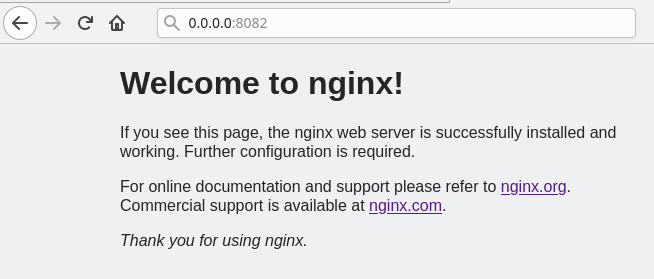

# Contenedores con Docker.

## Gontran Pestana Fernandez

## 1.1 Instalación

* Instalaremos docker en una maquina OpenSuse --> zypper in Docker.

* Iniciamos el servidor --> systemctl start docker.

* Y comprobamos el estdo de IP_FOrward-->cat /proc/sys/net/ipv4/ip_forward.

## 1.2 Primera Prueba.

* comprobamos la versión de docker --> docker version.

* Y lanzaremos el comando de descarga y ejecución --> docker run hellow-world.

* Y comprobamos que aparece nuestra nueva imagen --> docker images.

* y observamos que hay un contenedor en ejecución --> docker ps -a.

## 1.4 Alias

* Crearemos un fichero llamado .alias y lo utilizaremos para facilitarnos el trabajo añadiendole la salida de los comandos:

# 2 Creación manual de la imagen.

-Crearemos un contenedor Debian para nuestro sistema OpenSuse.

## 2.1 Crear un contenedor.

- Descargar una imagen.

* Descargaremos la imagen del Debian con el comando --> docker pull Debian.

* y comprobaremos su correcta descarga --> docker images.

- Crear un contenedor con el nombre app1debian y ejecutar el programa /bin/bash.

* comando--> docker run --name=app1debian -i -t debian /bin/bash

## 2.2 Personalizar el contenedor.

- Instalar aplicaciones en el contenedor.

*  comprobamos que estamos en Debian --> cat /etc/motd.

* instalamos nginx --> apt-get install nginx.

* e instalamos el editor vi --> apt-get install vim.

- Crearemos un fichero html.

* con elcomando --> echo "
Hola nombre-del-alumno
" > /var/www/html/holamundo1.html

- Generaremos un script en /root/server.sh

* #!/bin/bash
echo "Booting Nginx!"
/usr/sbin/nginx &

echo "Waiting..."
while(true) do
  sleep 60
done

## 2.3 Imagen a partir del contenedor.
- Ya tenemos un contenedor nginx ahora vamos a crear una imagen con lo que hemos incluido.

* Abrimos un terminal.

* y creamos la nueva imagen docker commit app1debian Gontran/nginx1

* Comprobamos que se a creado con --> docker images

# 3 Crear contenedor a partir de la imagen.

## 3.1 Crear contenedor con Nginx

- Ya tenemos una imagen con Nginx instalado y sera la que utilicemos.

* Iniciaremos el contenedor por medio de la imagen --> docker run --name=app2nginx1 -p 80 -t Gontran/nginx1 /root/server.sh

## 3.2 Comprobamos

* En un nuevo terminal lanzar el comando --> docker  ps

* Comprobación desde el navegador:

* Comprobacion holamundo1.html:

## 3.3 Migrar la imagen a otra maquina

- Exportar imagen docker  a un fichero tar.

* Guardamos la imagen Gontran/nginx1 en un .tar --> docker save -o gontran09docker.tar Gontran/nginx1

- Importar la imagen Docker:

* Utilizar la imagen de un compañero y la restauramos en nuestra maquina

comando --> docker load -i gontran09docker.tar

* Y comprobamos la nueva imagen --> docker images

* y creamos un contenedor app3gontran con la imagen --> docker run --name=app3gontran -i -t nombre-de-la-imagen /bin/bash

## 3.4 Capas

* Consultamos las capas de la imagen del compañero --> docker image history nombre_imagen:version

# 4. Dockerfile

- Ahora vamos a crear una imagen por medio de un fichero de configuración llamado Dockerfile.

## 4.1 Preparar ficheros

* Crearemos el directorio /home/Gontran/docker09a.

* Dentro de este directorio crear el fichero holamundo2.html

Proyecto=docker09a.
Autor=gontran.
Fecha=16/01/2021

* Crear el fichero Dockerfile con el contenido:

## 4.2 Crear imagen del Dockerfile

* Entramos en el directorio docker09a.

* Y construiremos la nueva imagen del Dockerfile --> docker build -t Gontran/nginx2 .

* Comprobaremos las imagenes --> docker images

## 4.3 Crear contenedor y Comprobar

- Crearemos un nuevo contenedor con el nombre app4nginx2 con la imagen gontran/nginx2.

* Lanzaremos el contenedor --> docker run --name=app4nginx2 -p 8082:80 -t gontran/nginx2

- Avrimos otro terminal:

* Comprobamos los contenedores en ejecución --> docker ps

* comprobamos el navegador:

## 4.4 Usar imagenes ya creadas

- Crearemos un dcker Nginx con las imagenes oficiales que ya existen.

* Crearemos el directorio /home/Gontran/docker09b.

* Dentro de este directorio crear el fichero holamundo3.html

Proyecto=docker09b.
Autor=gontran.
Fecha=16/01/2021

* Crear el fichero Dockerfile con el contenido:

FROM nginx

COPY holamundo3.html /usr/share/nginx/html
RUN chmod 666 /usr/share/nginx/html/holamundo3.html

* Crear la imagen --> docker build -t gontran/nginx3 .

* Comprobamos el acceso a holamundo3.html:

# 5. Docker Hub

* Creamos una carpeta llamada docker09c

* Dentro añadiremos dos scrips llamados holamundo09.sh y otro llamado Dockerfile:

* Creamos una imagen a partir del fichero Dockerfile --> docker build -t gontran/holamundo .

* Y crearemos su cotenedor --> docker run gontran/holamundo
- Subir la imagen a Docker  Hub
* Nos crearemos una cuenta de docker hub desde el navegador.

* abriremos una conexión --> docker login -u gontran2021

* Y etiquetaremos nuestra imagen docker tag gontran/holamundo:latest gontran2021/holamundo:version1

* Y subiremos la imagen -->docker push gontran2021/holamundo:version1

 

 # 6.Limppiar contenedores e imagenes

 - EN este apartado borrraremos los contenedores y las imagenes que hemos ido creando.

* docker ps -a, identificar todos los contenedores que tenemos.
* docker stop ..., parar todos los contenedores.
* docker rm ..., eliminar los contenedores

* docker images, identificar todas las imágenes.
* docker rmi ..., eliminar las imágenes.
