# Salt-stack

- Herramienta de tipo gestor de infraetructuras.

                                                  ## Gontran Pestana Fdez - 01/02/2021

## 1.1 Preparativos

- MV1--> master09g - OpenSUSE - 192.168.1.31
- MV2--> minion09g - OpenSUSE - 192.168.1.32
- MV3--> minion09w - Windows  - 192.168.1.11

# 2.Master: instalar y configurar

- En la MV1 ejecutar --> zypper install salt-master.

- Añadir al archivo de configuración /etc/salt/master la ip del master y su ruta:

interface: 192.168.1.31
file_roots:
base:
  -/srv/salt

- Iniciamos el servicio y activamos el servicio para el arranque del sistema:

systemctl start salt-master.service
systemctl enable salt-master.service

- Y consultamos los minion aceptados --> salt-key -L (No habra ninguno)

# 3.Minion

- Instalamos el software --> zypper install salt-minion

- Y le indicamos en /etc/salt/minion quien sera el Master:

master: 172.19.XX.31

- Iniciamos el servicio y activamos el servicio para el arranque del sistema:

 systemctl start salt-master.service
 systemctl enable salt-master.service

## 3.2 Cortafuegos

Nos aseguraremos de que en la MV1 el cortafuegos permite las conexiones al servicio Salt.

- Consultar la zona de red -->firewall-cmd --get-active-zones

- Abrir puerto de forma permanente en la zona "public" --> firewall-cmd --zone=public --add-port=4505-4506/tcp --permanent

- Reiniciar el firewall --> firewall-cmd --reload

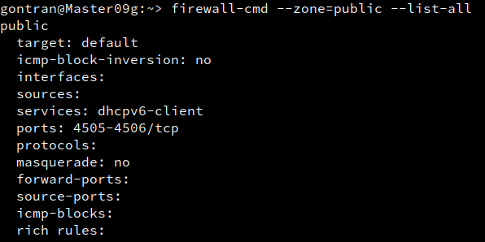

## 3.3 Aceptación desde el Master

- En MV1 vemos que recibe la peticion del Minion09g --> salt-key -L

- Aceptamos su petición --> salt-key -a minion09g

- Y comprobamos:

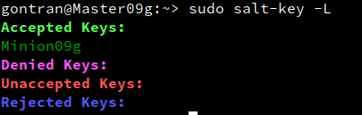

## 3.4 Comprobamos conectividad

En el Master:

- Conectividad con el minion y su versión instalada:

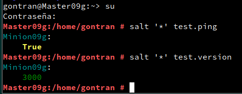

# 4.Salt States

## 4.1 Preparar el directorio para los estados

Crear directorios para guardar lo estados de Salt en MV1.

- Crear directorios /srv/salt/base y /srv/salt/devel

- Crear archivo /etc/salt/master.d/roots.conf con el siguiente contenido:

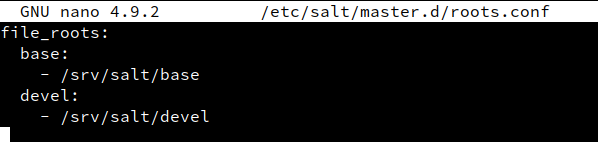

## 4.2 Crear un nuevo estado

Los estados se definen en ficheros .sls

- Crear fichero /srv/salt/base/apache/init.sls:

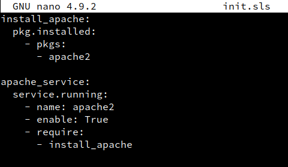

## 4.3 Asociar Minions a estados

En MV1:

- Crear /srv/salt/base/top.sls, donde asociamos a todos los Minions con el estado que acabamos de definir.

base:
  '*':
    - apache

## 4.4 Comprobamos los estados

- consultar los estados que tenemos definidos:

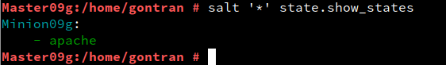

## 4.5 Aplicar el nuevo estado

En MV1:

- Consultar los estados en detalle y verificar que no hay errores en las definiciones.

salt '*' state.show_lowstate

salt '*' state.show_highstate

- Aplicar el nuevo estado en todos los minions:

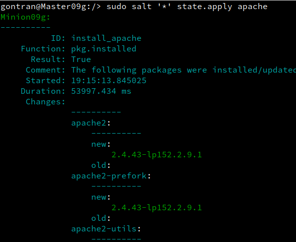
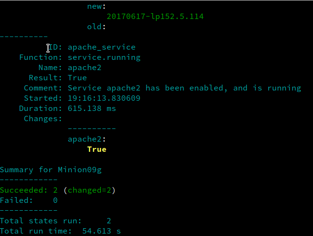

# 5. Crear más estados

## 5.1 Crear estado "users"

Crear un estado llamado users que nos servirá para crear un grupo y usuarios en las máquinas Minions

- Crear directorio /srv/salt/base/users.

- Crear fichero /srv/salt/base/users/init.sls con las definiciones para crear los siguiente:

        Grupo mazingerz
        Usuarios kojiXX, drinfiernoXX

- Aplicar el estado --> salt '*' state.apply users

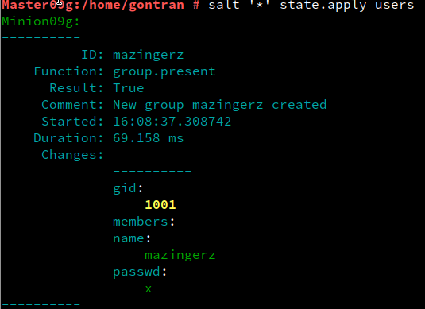
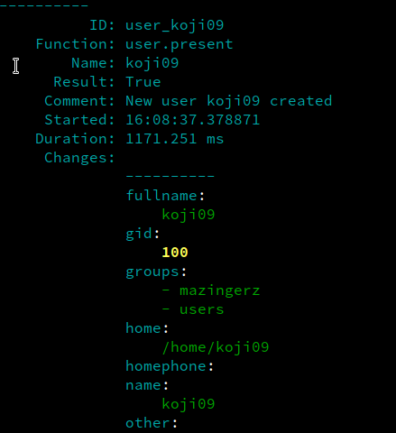
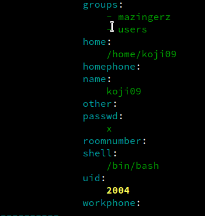
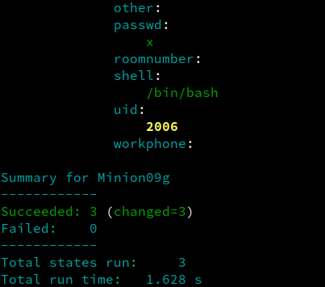

## 5.2 Crear estado "dirs"

- Crear estado dirs para crear las carpetas private (700), public (755) y group (750) en el HOME del usuario koji

- Aplicar estados dirs:

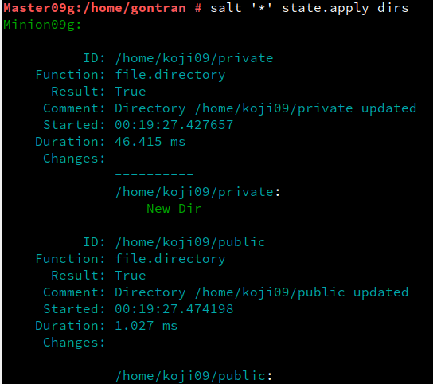
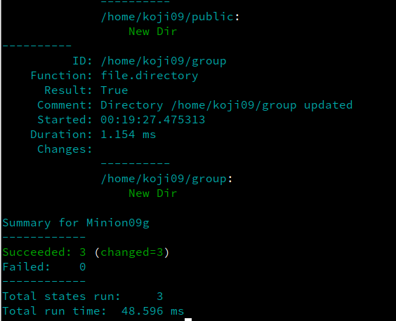

## 5.3 Ampliar estado "apache"

- Crear el fichero /srv/salt/base/files/holamundo.html. Escribir dentro el nombre del alumno y la fecha actual.

- Incluir en el estado "apache" la creación del fichero "holamundo" en el Minion.

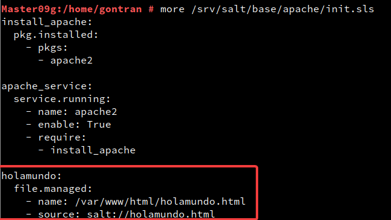

- Aplicar el estado apache:

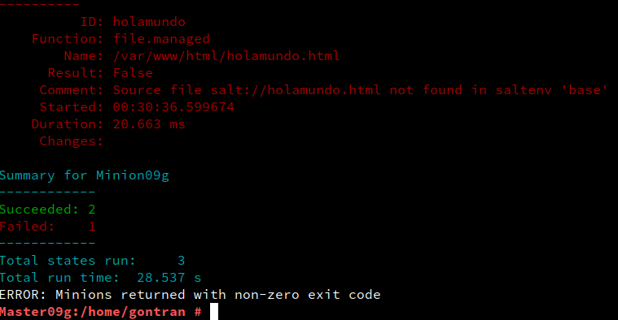
