#Acceso Remoto SSH.

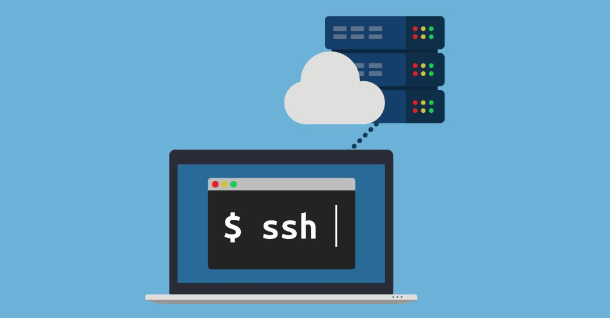

                                  Gontran Pestana Fernández - 2ºASIR - P2

##Preparativos.

Un servidor SSH	GNU/Linux OpenSUSE (Sin entorno gráfico)	con ip 172.19.9.31 llamado server09g.

Un cliente SSH,	GNU/Linux OpenSUSE con ip	172.19.9.32	llamado client09g.

Un cliente SSH,	Windows con ip	172.AA.XX.12 llamado  cliente09w.

##Servidor SSH.

-Añadir en /etc/hosts los equipos client09g y client09w.

-Posteriormente crear los siguientes usuarios en server09g:
  Pestana1.
  Pestana2.
  Pestana3.
  Pestana4.

##Cliente Linux

-Añadir en /etc/hosts los equipos server09g, y client09w.

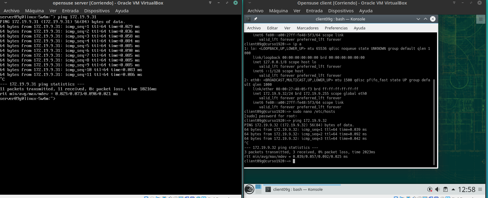

##Cliente Windows

-Instalar software cliente SSH en Windows usando PuTTY.

-Añadir en "C:\Windows\System32\drivers\etc\hosts" los equipos server09g y client09wg.

#Instalación del servicio SSH en GNU/Linux

-Instalar el servicio SSH en la máquina serverXXg utilizando el comando "zypper install openssh".

##Comprobación

-Desde el servidor asegurarnos que el servicio esta funcionando.

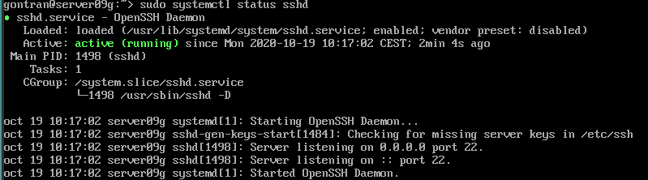

##Conexión SSH desde el client09g

-Comprobar realizando un ping y un nmap al server09g.

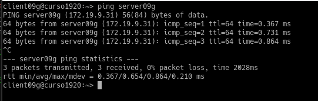

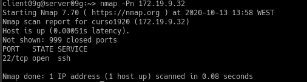

-Desde el ciente nos conectamos mediant ssh.

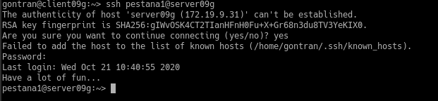

##Conexión SSH desde cliente Windows

-Nos conectamos utilizando PuTTY.

-Guardar la identificación del servidor.

#Cambiamos la identidad del servidor

-Modificar el fichero de configuración SSH (/etc/ssh/sshd_config) para dejar una única línea: HostKey /etc/ssh/ssh_host_rsa_key Y Comentar el resto de líneas con configuración HostKey.

-Posteriormente regenerar el certificado con el comando "sudo ssh-keygen -t rsa -f /etc/ssh/ssh_host_rsa_key" y comprobar el estado de sshd.

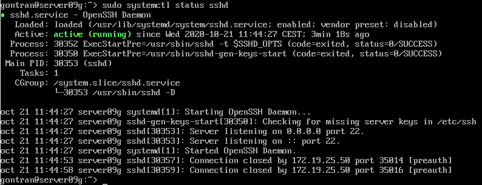

##Comprobamos

-Comprobar qué sucede.

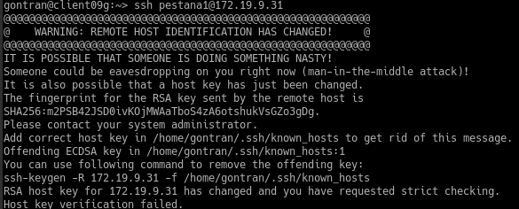

-Para solucionarlo utilizar el siguiente comando y se regeneraran las claves antiguas.

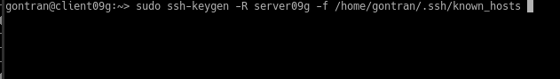

#Personalización del prompt Bash

-Añadimos las siguientes lineas al fichero (/home/1er-apellido-alumno1/.bashrc).

"if [ -n "$SSH_CLIENT" ]; then
PS1="AccesoRemoto_\e[32m\u@\h:\e[0m \w\a\$ "
else
PS1="\[$(pwd)\]\u@\h:\w>"
fi"

-Y creamos el fichero: /home/1er-apellido-alumno1/.alias" y añadimos las siiguientes lienas:

" alias c='clear'
alias g='geany'
alias p='ping'
alias v='vdir -cFl'
alias s='ssh' "

-Comprobamos el funcionamiento de la conexiones SSH

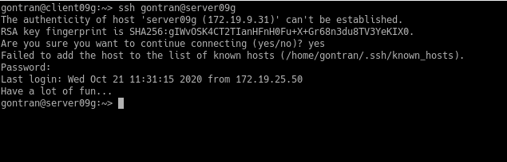

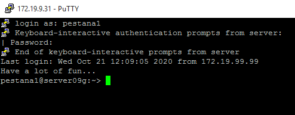

#Autenticación mediante claves públicas

-Utilizamos la maquina cliente09g y generaremos un nuevo par de claves con ssh-keygen -t rsa.

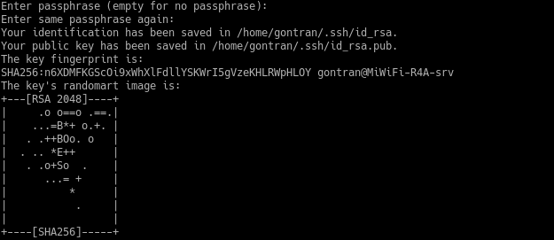

-Después copiamos la clave publica al fichero "authorized_keys" del usuario remoto
 Pestana1 con el comando --> ssh-copy-id Pestana1@server09g.

-Comprobar que ahora al acceder remotamente vía SSH
Desde client09g, NO se pide password.
Desde client09w, SI se pide el password.

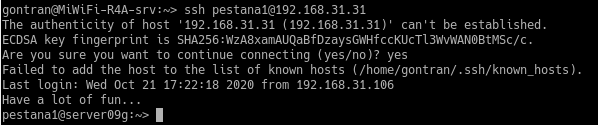

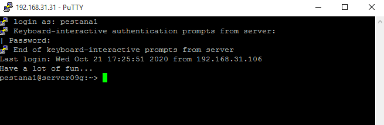

#Uso de SSH como túnel para X

-Descargar una app desde el server09g.

-Modificar el servidor SSH para permitir la ejecución --> /etc/ssh/sshd_config --> X11Forwarding yes.

-Para conectarnos en tunel al servidor utilizar --> ssh -X Pestana1@server09g.

###En la barra de nveegacion se puede ver el geany instalado.

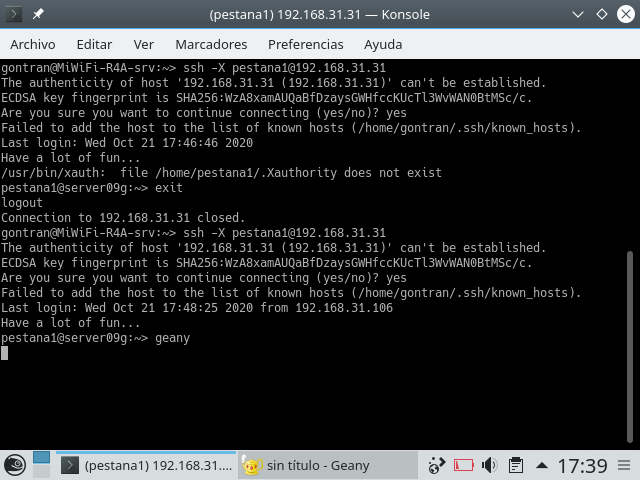

#Aplicaciones Windows nativas

-Al instalar el wine y intentar utilizar el wine notepad desde el client09w me sale un mensaje de error que me impide utilizar dicha aplicación.

#Restricciones de uso

##Restricción sobre un usuario

-Vamos a modificar SSH de modo que al usar el usuario por SSH desde los clientes tendremos permiso denegado.

-Modificar fichero de configuración del servidor SSH (/etc/ssh/sshd_config) para restringir el acceso a determinados usuarios utilizando DenyUsers seguido del user@client09g.

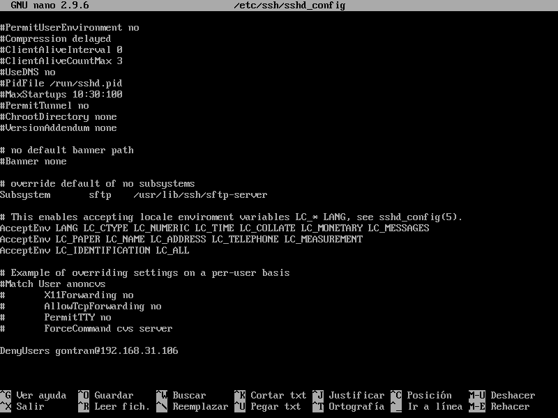

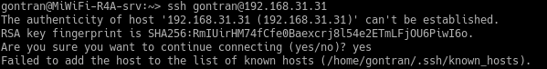
