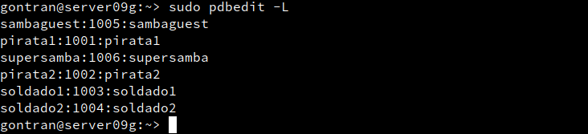

#Samba en OpenSUSE y Windows.

                            Gontran Pestana   Fernández     2ºASIR - P2

Samba es un proyecto de software libre que implementa el protocolo de archivos compartidos de Windows para Sistemas operativos de tipo UNIX.

#1. Servidor Samba.

##Preparativos.

-Configuraremos dos máquina OpenSUSE con ip estática que funcionara como servidor y la llamaremos server09g y otra llamada client09g que actuara como cliente.

-Configuraremos una maquina Windows con ip estatica que funcionara como Cliente y la llamaremos cliente09w.

-Y modificaremos los ficheros /etc/hosts con las ips de las otras dos maquinas virtuales.

##Configurar usuarios locales.

Crearemos usuarios y grupos en el server09g.

-Crear los grupos piratas,soldados y sambausers.

-Crear los usuarios sambaguest, sambausers,  pirata1, pirata2, soldado1, soldado2.

-Y pondremos cada usuario en su grupo correspondiente.

##Crear las carpetas para recursos compartidos.

-Creamos la carpeta base para los recursos de red de Samba y le damos permisos.

    mkdir /srv/samba09
    chmod 755 /srv/samba09

-Y creamos las carpetas para los recursos compartidos y les damos los permisos requeridos.

##Configurar el servidor Samba

-Haremos una copia de la carpeta que modificaremos     cp /etc/samba/smb.conf /etc/samba/smb.conf.bak.

-PAra configurarlo iremos a yast -> Samba server pondremos de workgruop: curso2021.

-En la pestaña de Inicio definimos que al iniciar el servicio durante el arranque y en Ajustes del cortafuegos -> Abrir puertos.

##Crear los recursos compartidos de red.

 Para esto onfiguraremos los ficheros desde el terminal.

-public -> será un recurso compartido accesible para todos los usuarios en modo lectura.

-barco, recurso compartido de red de lectura/escritura paralos piratas.

-castillo, recurso compartido de red de lectura/escritura para los soldados.

##Usuarios Samba

Añadiremos los usuarios crados al servidor Samba con el comando smbpasswd a- NOMBREUSUARIO .

-Le asignaremos una contraseña.

-Y comprobaremos la lista de usuarios.

##Reiniciar el Sistema

#2.Windows

-Configurar el cliente Windows 10.

-Ponerle de nombre client09w y ip 172.19.9.12.

-Configurar el fichero /drivers/etc/hosts.

##Cliente Windows

Accederemos desde este a los recursos compartidos.

-En la barra de búsquedas de carpetas ecribiremos \\server09g ó (ip del servidor).

-Accederemos al recurso public.

-Accederemos al recurso castillo con los usuarios soldados.

-Accederemos al recurso barco con los usuarios piratas.

-Y en el servidor ejecutaremos los siguientes comandos para comprobar los resultados:

#1

#2

##Montra el recurso barco de forma persistente.

#Ver todos los recursos.

-Crear y montar el recurso compartido:

"net use S: \\172.19.9.31\barco.d contraseña /USER:pirata1 /p:yes".

-Comprobamos con net use.

-Comprobamos con los comandos del ejercicio anterior:

#1

#2

#3.Cliente GNU/Linux

Ejemplo accediendo al recurso prueba del servidor Samba.

##Cliente GNU/Linux comandos

-Probar desde el cliente GNU/Linux el comando smbclient --list

-Crearemo una carpeta local en /mt/remoto09/castillo.

-Montaje manual: montaremos el recurso con el siguiente comando--> mount -t cifs //172.AA.XX.31/castillo /mnt/remotoXX/castillo -o username=soldado1.

-Y comprobaremos

##Montaje automático.

-Para configurar acciones de montaje automáticos cada vez que se inicie el equipo, debemos configurar el fichero /etc/fstab.

